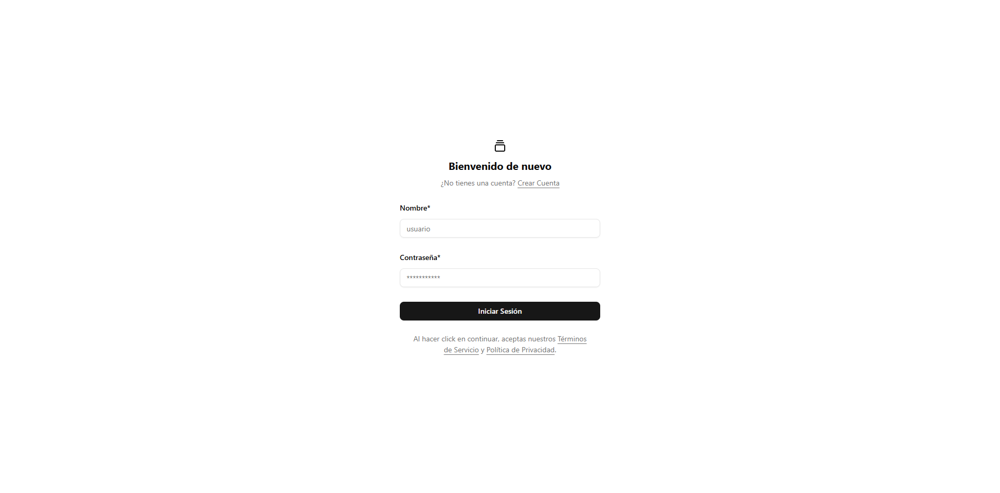
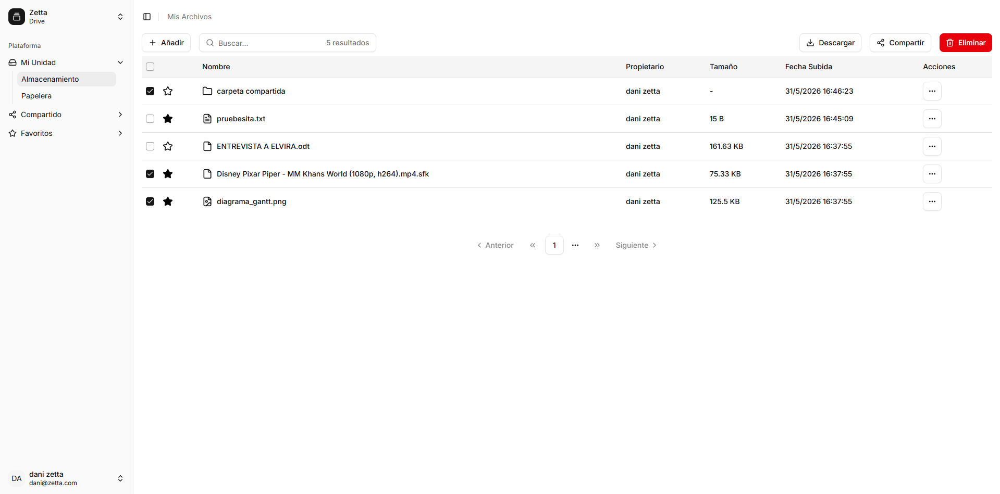
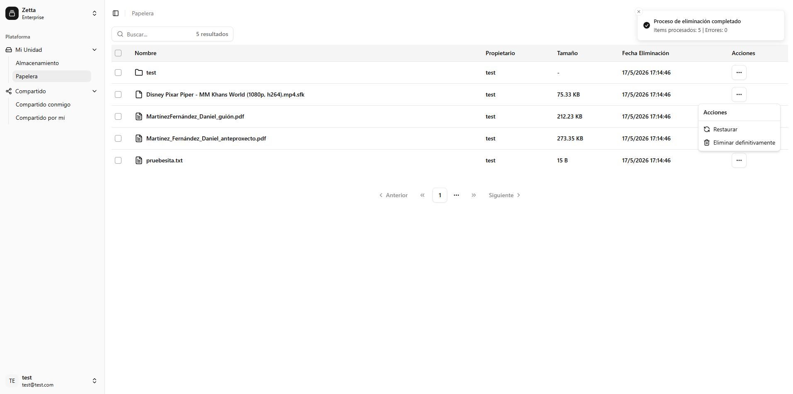
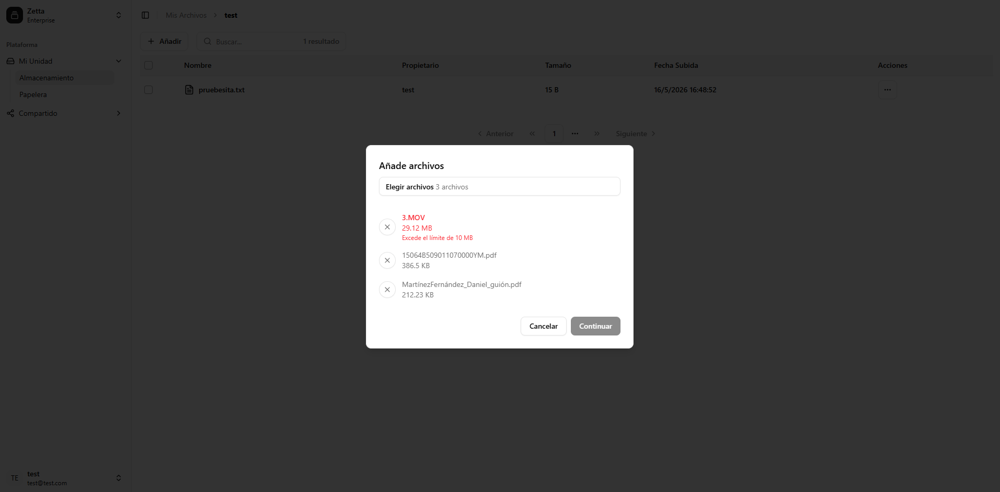
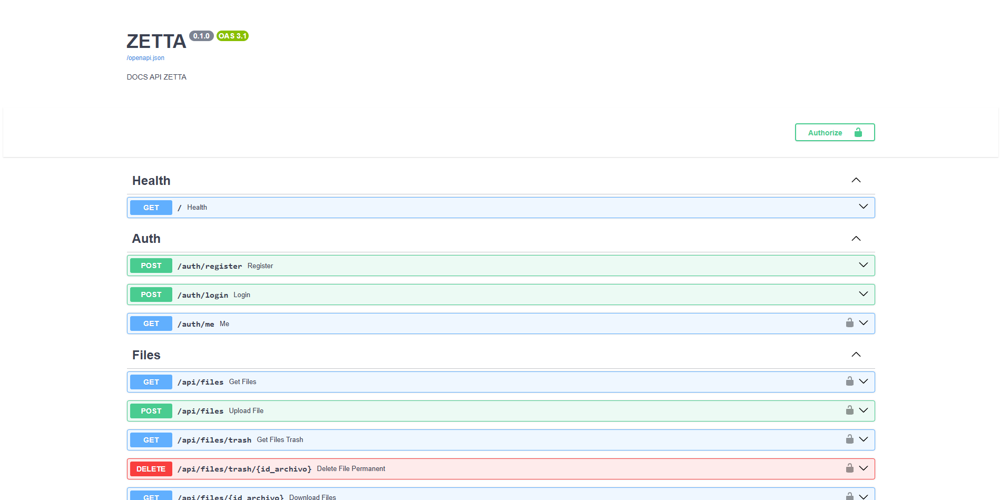
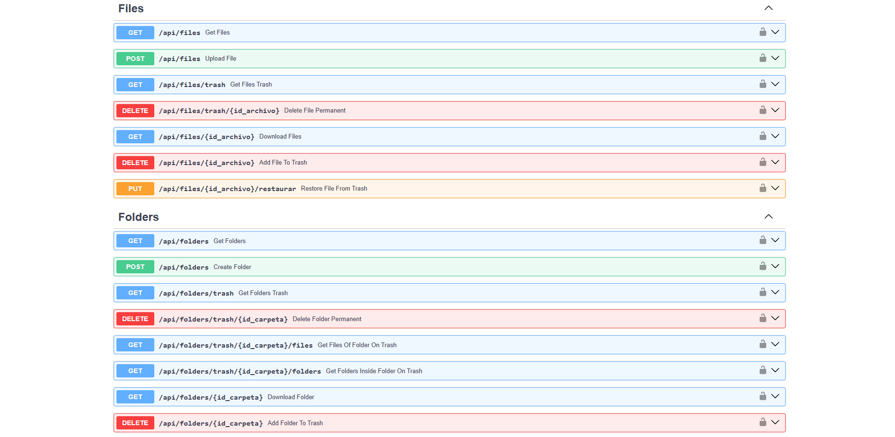
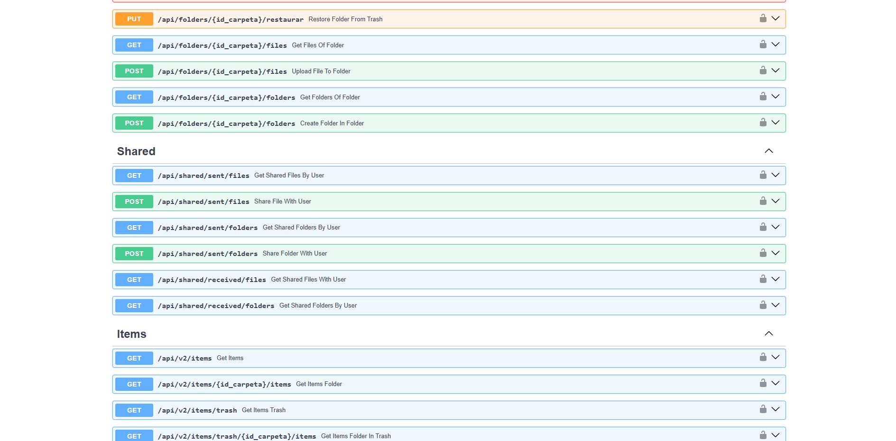
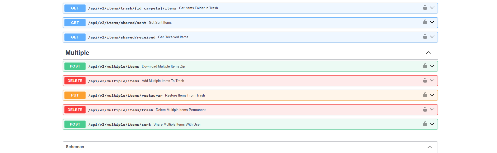

# Zetta Drive

Sistema de almacenamiento y gestión de archivos en la nube inspirado en Google Drive.  
Zetta permite subir archivos, organizarlos en carpetas o descargar archivos y carpetas comprimidas en ZIP. Dispone de una papelera totalmente funcional que elimina items definitivamente después de 30 días, además de la posibilidad de compartir archivos y carpetas con otros usuarios.

**URL Demo:** [https://zetta-drive.netlify.app/](https://zetta-drive.netlify.app/)  
**URL Desarrollo:** [https://develop--zetta-drive.netlify.app/](https://develop--zetta-drive.netlify.app/)

> Nota: La demo se ejecuta en infraestructura de nivel gratuito, por lo que los tiempos de carga iniciales pueden ser más largos de lo esperado.

<table width="100%">
  <tr>
    <td align="center">
      
      <br>
      <sub>Login</sub>
    </td>
    <td align="center">
      
      <br>
      <sub>Almacenamiento</sub>
    </td>
  </tr>

  <tr>
    <td align="center">
      
      <br>
      <sub>Papelera</sub>
    </td>
    <td align="center">
      
      <br>
      <sub>Subida de archivos</sub>
    </td>
  </tr>
</table>

## Índice

- [Objetivos](#objetivos)
- [Funcionalidades Principales](#funcionalidades-principales)
- [Estructura del Proyecto](#estructura-del-proyecto)
- [Modelo de Base de Datos](#modelo-de-base-de-datos)
- [Tecnologías](#tecnologías)
- [Instalación y Configuración](#instalación-y-configuración)
- [Configuración de Variables de Entorno](#configuración-de-variables-de-entorno)
- [Ejecución Local](#ejecución-local)
- [Endpoints de la API](#endpoints-de-la-api)
- [Mejoras Futuras](#mejoras-futuras)
- [Autor](#autor)

## Objetivos

- Proporcionar almacenamiento en la nube con organización basada en carpetas
- Permitir compartir archivos y carpetas con otros usuarios con control de acceso basado en propiedad
- Permitir estructuras de carpetas jerárquicas para una mayor organización
- Proporcionar una interfaz web atractiva e intuitiva

## Funcionalidades Principales

### Autenticación y Autorización

- Registro de usuarios con validación de email y nombre de usuario
- Autenticación basada en JWT
- Hash seguro de contraseñas
- Gestión de sesiones basada en tokens con expiración configurable (predeterminada: 60 minutos)

### Gestión de Archivos

- Subida múltiple de archivos tanto dentro como fuera de carpetas
- Progeso de descarga y subida en tiempo real
- Organización jerárquica de carpetas con anidamiento ilimitado
- Navegación y exploración de archivos y carpetas con paginación
- Seguimiento de fecha de creación, tamaño de archivo, propietario...
- Eliminación de archivos y carpetas con período de retención de 30 días en la papelera y la posibilidad de restaurarlos
- Eliminación permanente automática de elementos de la papelera
- Búsqueda de elementos y paginación en todas las funcionalidades

### Compartir Archivos y Carpetas

- Compartir múltiples archivos a la vez con otros usuarios
- Compartir múltiples carpetas completas a la vez con otros usuarios
- Distinción entre permisos de propietario y receptor
- Ver elementos compartidos o recibidos y la posibilidad de descargarlos

### Favoritos

- Añadir archivos y carpetas a favoritos
- Visualizar contenido destacado

### Características de Seguridad

- Middleware CORS para solicitudes de origen cruzado
- Soporte HTTPS en producción
- Gestión de configuración basada en entorno (desarrollo o producción)
- Agrupación de conexiones de base de datos para optimización de recursos
- Rate limit para evitar abusos a los endpoints del api
- Logs de eventos importantes del backend

## Estructura del Proyecto

El proyecto está dividido en dos áreas principales: backend y frontend.

### Backend

El backend se encuentra en `backend/` y sigue una arquitectura por capas:

- `app/config.py`: gestiona la configuración y carga de las variables de entorno
- `app/main.py`: inicializa FastAPI, registra rutas y configura middleware
- `app/database`: centraliza la conexión a PostgreSQL y soporta migraciones
- `app/models`: define los modelos de datos para usuarios, archivos, carpetas y elementos compartidos
- `app/routes`: agrupa los endpoints del API por funcionalidad: autenticación, archivos, carpetas, compartidos y salud
- `app/schemas`: contiene los esquemas de validación de solicitudes y respuestas con Pydantic
- `app/services`: implementa la lógica de negocio
- `app/repositories`: encapsula las operaciones de acceso a datos sobre la base de datos
- `app/middleware`: incluye validadores de JWT y paginación
- `app/core`: contiene limitador de peticiones, lifespan y configuración de logging

Además, el backend incluye los recursos de despliegue y operación:

- `docker-compose.dev.yml` y `docker-compose.prod.yml`: definición de los servicios Docker
- `Dockerfile.dev` y `Dockerfile`: imágenes para desarrollo y producción
- `entrypoint.sh`: script de arranque para la imagen de producción.
- `requirements.txt` y `requirements-dev.txt`: dependencias de Python
- `alembic/`: migraciones de la base de datos
- `uploads/`: almacenamiento de archivos subidos en el contenedor en caso de no especificar otro directorio

### Frontend

El frontend se encuentra en `frontend/` y está estructurado para una SPA Vue:

- `src/main.ts`: punto de entrada de la aplicación.
- `src/App.vue`: componente raíz.
- `src/router`: configuración de rutas de la SPA con sus guards de navegación.
- `src/stores`: estado global con Pinia.
- `src/api`: cliente Axios y tipos generados para la API.
- `src/services`: llamadas a la API y lógica de comunicación.
- `src/components`: componentes reutilizables de interfaz.
- `src/views`: páginas principales como login, registro, drive y papelera.
- `src/utils`: utilidades comunes y validadores.
- `src/lib`: helpers específicos del proyecto.

También contiene:

- `public/`: recursos estáticos accesibles directamente.
- `vite.config.ts`: configuración del bundler Vite.
- `package.json`: dependencias y comandos de npm.
- `tsconfig.json`: configuración de TypeScript.

### Componentes de la Arquitectura

**Frontend:**

- Vue.js 3 (Composition API) con TypeScript y VueRouter para construir la SPA (Single Page Application)
- Vite como herramienta de compilación
- Vue Query (TansTack Query) para gestión de estado del servidor y Axios para las peticiones.
- Pinia para la gestión de estado global del lado del cliente
- Tailwind CSS + Shadcn UI para los componentes UI
- OpenAPI TypeScript para generar tipado de TypeScript automáticamente a partir de la documentación del backend
- VeeValidate + Zod para la validación de esquemas

**Backend:**

- Python con FastAPI para API Rest de alto rendimiento
- Arquitectura por capas
- Autenticación JWT con python-jose
- SlowAPI para limitar el número de peticiones a los endpoints
- APScheduler para tareas programadas (limpieza de la papelera)
- Pytest para testing del backend

**Datos:**

- PostgreSQL con agrupación de conexiones
- SQLAlchemy ORM para gestionar SQL
- Claves primarias UUID
- Alembic para las migraciones de la base de datos

**Otros:**

- Docker y Docker Compose:
  - Un contenedor dev con la API, la base de datos postgre y adminer (gestor de base de datos)
  - Otro contenedor prod con la api listo para el despliegue.

## Modelo de Base de Datos

El sistema utiliza una base de datos relacional con las siguientes entidades principales:

```
USUARIOS
├─ id (UUID)
├─ nombre (username único)
├─ correo (email único)
├─ contraseña (hasheada)
└─ fecha_creacion

CARPETAS
├─ id (UUID)
├─ nombre_original
├─ path (ruta del sistema de archivos)
├─ fecha_creacion
├─ fecha_eliminacion (soft delete)
├─ id_usuario (FK)
└─ id_carpeta (auto-referencia para jerarquías)

ARCHIVOS
├─ id (UUID)
├─ nombre_original
├─ path (ruta del sistema de archivos)
├─ tamaño_bytes
├─ fecha_creacion
├─ fecha_eliminacion (soft delete)
├─ id_usuario (FK)
└─ id_carpeta (FK, nullable para archivos raíz)

CARPETAS_COMPARTIDAS
├─ id (UUID)
├─ fecha_compartido
├─ id_propietario (FK → USUARIOS)
├─ id_receptor (FK → USUARIOS)
└─ id_carpeta (FK → CARPETAS)

ARCHIVOS_COMPARTIDOS
├─ id (UUID)
├─ fecha_compartido
├─ id_propietario (FK → USUARIOS)
├─ id_receptor (FK → USUARIOS)
└─ id_archivo (FK → ARCHIVOS)
```

### Relaciones Clave

- **Usuarios a Archivos/Carpetas:** Relación N:M; los usuarios pueden crear múltiples archivos y carpetas
- **Carpetas a Archivos/Subcarpetas:** Relación recursiva que permite la creación de carpetas anidadas
- **Usuarios a Elementos Compartidos:** N:M a través de tablas de unión (CarpetasCompartidas y ArchivosCompartidos)
- **Soft Delete:** Archivos y carpetas tienen el campo nullable `fecha_eliminacion` para permitir la funcionalidad de la papelera

## Tecnologías

### Frontend

| Tecnología         | Versión | Propósito                                           |
| ------------------ | ------- | --------------------------------------------------- |
| Vue.js             | 3.5.26  | Framework JavaScript progresivo                     |
| TypeScript         | 5.9.3   | Superset seguro de JavaScript con tipos             |
| Vite               | 7.3.0   | Herramienta de compilación y servidor de desarrollo |
| Tailwind CSS       | 4.1.18  | Framework CSS utilitario-first                      |
| Reka UI            | 2.9.7   | Librería de componentes sin estilos                 |
| TanStack Vue Query | 5.92.9  | Gestión de estado del servidor                      |
| Pinia              | 3.0.4   | Gestión de estado de Vue                            |
| Vue Router         | 4.6.4   | Enrutamiento del lado del cliente                   |
| Axios              | 1.13.4  | Cliente HTTP                                        |
| Zod                | 3.25.76 | Validación de esquemas                              |
| Vee-Validate       | 4.15.1  | Validación de formularios                           |

### Backend

| Tecnología      | Versión | Propósito                                  |
| --------------- | ------- | ------------------------------------------ |
| FastAPI         | 0.128.0 | Framework web                              |
| SQLAlchemy      | 2.0.45  | ORM y kit de herramientas de base de datos |
| PostgreSQL      | Última  | Base de datos relacional                   |
| python-jose     | 3.5.0   | Implementación JWT                         |
| Uvicorn         | 0.40.0  | Servidor ASGI                              |
| APScheduler     | 3.11.2  | Programación de tareas                     |
| SlowAPI         | 0.1.9   | Limitación de velocidad                    |
| Alembic         | 1.18.1  | Migraciones de base de datos               |
| Pydantic        | 2.12.5  | Validación de datos                        |
| psycopg2-binary | 2.9.11  | Adaptador PostgreSQL                       |

### DevOps y Herramientas

- **Docker y Docker Compose** para levantar el backend
- **Python 3.12** como entorno de ejecución
- **Node.js 20+** para proceso de compilación del frontend
- **Git** para control de versiones

## Instalación y Configuración

### Requisitos Previos

- Python 3.12+
- Node.js 20+ (versión LTS recomendada)
- Base de datos PostgreSQL 12+
- Docker y Docker Compose
- Git

### Clonar el Repositorio

```bash
git clone https://github.com/mfdanielmf/zetta.git
cd zetta
```

### Configuración del Backend

El backend no necesita configuración manual para ejecutarse en desarrollo local. Se inicia con Docker Compose y utiliza el archivo `backend/.env` para sus variables de entorno.

1. **Navegar al directorio del backend:**

   ```bash
   cd backend
   ```

2. **Iniciar los servicios con Docker Compose:**

   ```bash
   docker-compose -f docker-compose.dev.yml up -d
   ```

El contenedor de la API carga las dependencias definidas en `Dockerfile.dev` y el servicio de base de datos PostgreSQL se levanta automáticamente.

### Configuración del Frontend

1. **Navegar al directorio del frontend:**

   ```bash
   cd frontend
   ```

2. **Instalar dependencias:**

   ```bash
   npm install
   ```

## Configuración de Variables de Entorno

### Variables de Entorno del Backend

El backend usa Docker Compose y carga su configuración desde `backend/.env` en el entorno de desarrollo. No es necesario crear manualmente un entorno virtual ni instalar dependencias de Python para ejecutar el backend localmente.

Si necesitas personalizar valores, puedes editar `backend/.env`. Utiliza `backend/.env.example` como referencia para desarrollo o `backend/.env.prod.example` como referencia para producción.

### Variables de Entorno del Frontend

Crear un archivo `.env` en el directorio `frontend/`. Hay un ejemplo en `frontend/.env.example`.

Ejemplo básico:

```env
VITE_API_BASE_URL=http://localhost:8080
```

### Configuración de Producción

Para producción, crea un archivo `backend/.env.prod` con valores apropiados y ajusta los parámetros de Docker Compose según tus necesidades.

- `ENVIRONMENT=prod`
- `JWT_SECRET_KEY` fuerte
- `ALLOWED_ORIGINS` con el dominio real
- Credenciales de base de datos de producción

## Ejecución Local

### Backend: Usando Docker Compose (Desarrollo)

El backend se ejecuta exclusivamente con Docker Compose en desarrollo. No es necesario configurar manualmente el entorno de Python.

```bash
cd backend
docker-compose -f docker-compose.dev.yml up -d
```

Esto levanta:

- La API FastAPI
- La base de datos PostgreSQL
- Adminer en `http://localhost:8000`

El backend queda disponible en `http://localhost:8080` y la documentación de OpenAPI en `http://localhost:8080/docs` o `http://localhost:8080/redoc`.

### Frontend

El frontend se ejecuta localmente con npm:

```bash
cd frontend
npm install
npm run dev
```

El frontend estará disponible en `http://localhost:5173`.

### Backend: Usando Docker Compose (Producción)

```bash
cd backend
docker-compose -f docker-compose.prod.yml up -d
```

## Endpoints de la API

Los endpoints de la API están disponibles en `http://localhost:8080/docs` o `http://localhost:8080/redoc` (después de haber levantado el backend con Docker).






### Paginación

Todos los endpoints de lista soportan paginación con parámetros de consulta y están limitados para evitar abusos:

- `page`: Número de página (predeterminada: 1)
- `limit`: Elementos por página (predeterminada: 10)

Ejemplo: `GET /files?page=2&limit=20`

### Formato de Respuesta

Respuestas exitosas:

```json
{
  "items": [
    /* items */
  ],
  "total": 1,
  "pagina": 2,
  "limite": 20
}
```

## Mejoras Futuras

### Funcionalidades Previstas

1. **Permisos avanzados:** Permisos de lectura/escritura/eliminación para elementos compartidos
2. **Vista previa de archivos:** Vista previa para imágenes, PDFs, documentos...
3. **Filtrado:** Opciones de filtrado avanzado
4. **URL temporal:** Enlaces temporales para permitir descargas de recursos a cualquier usuario sin cuenta en Zetta
5. **Integración con buckets de almacenamiento:** Integración con Amazon S3 para almacenar los archivos (actualmente se guardan en el propio sistema de archivos del servidor)
6. **Colaboración en tiempo real**: Permitir invitar a otros usuarios a editar el mismo archivo en tiempo real
7. **Pausar, cancelar y reanudar**: Permitir pausar, cancelar o reanudar tanto descargas como subidas de archivos y carpetas

### Mejoras de Rendimiento

- Optimizar subidas y descargas de archivos
- Optimizar consultas a base de datos y añadir indexación

### Mejoras de Seguridad

- Enviar código a correo de usuario para mejorar la seguridad
- Añadir refresh tokens

## Autor

Desarrollado por **Daniel Martínez Fernández** en 2026.  
TFC Grado Superior Desarrollo de Aplicaciones Web.

---

**Última Actualización:** 31/05/2026
